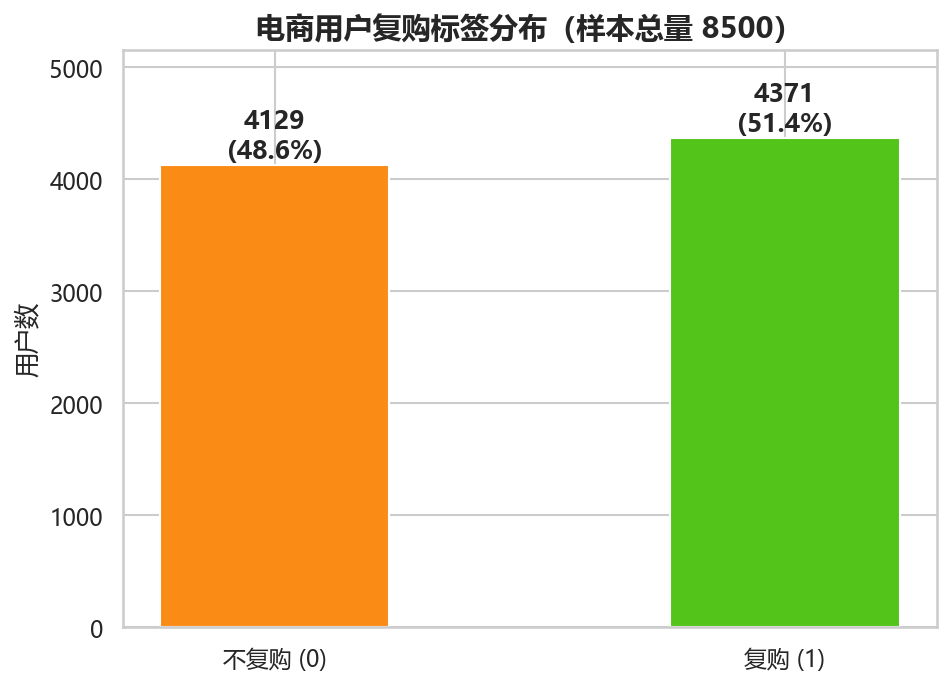
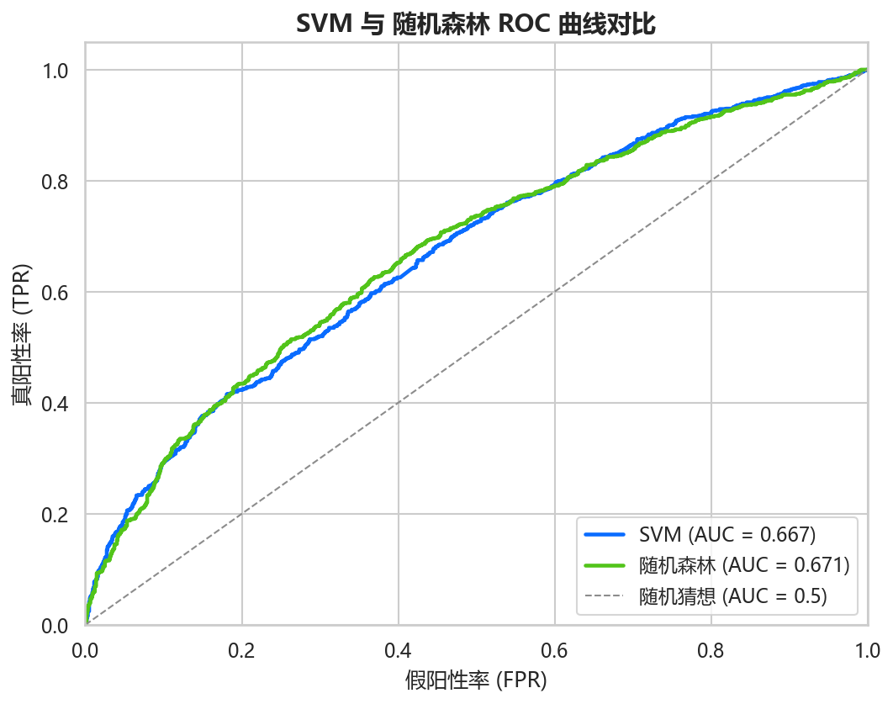
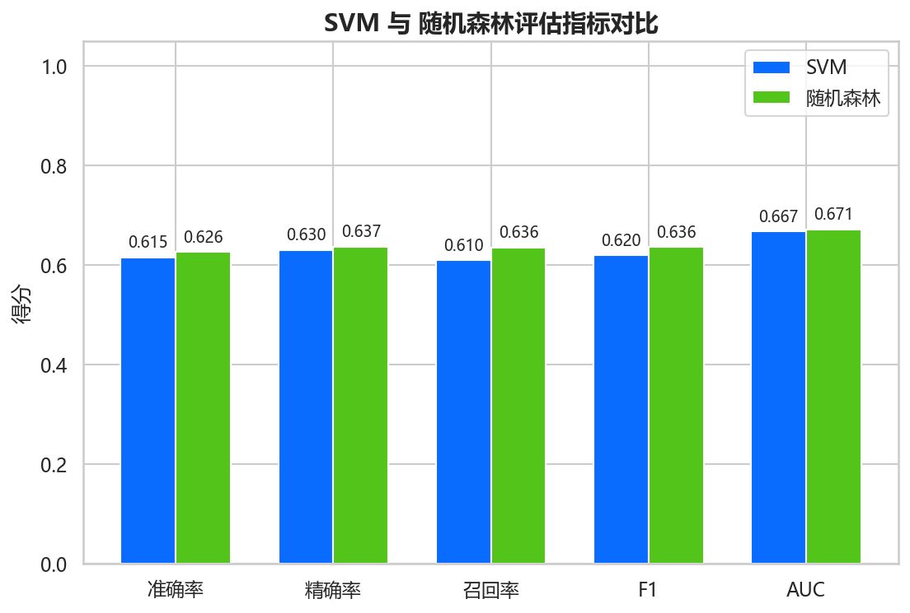

# 电商复购预测系统 (Ecommerce Repurchase System)

融合 PCA 与因子分析的电商用户复购预测可视化大屏
（SVM、随机森林对比建模 · FastAPI 后端 + Vue3 DataV 前端）

## 技术栈

- **后端**：Python 3.13 / FastAPI / scikit-learn / numpy / pandas / matplotlib / seaborn
- **前端**：Vue3 + Vite / ECharts 5 / Element Plus / GSAP
- **数据**：`dataset/ecommerce_repurchase_8500.csv`（8500 条、36 维特征 + 复购标签）

## 快速启动

### 1. 安装后端依赖

```bash
pip install -r backend/requirements.txt
```

### 2. 安装前端依赖

```bash
cd frontend
npm install
cd ..
```

### 3. 生成数据集（首次需要，已存在可跳过）

```bash
python data_generate/generate_dataset.py
```

### 4. 启动后端（端口 8000）

方式一（推荐，项目根目录）：

```bash
python -m uvicorn backend.main:app --host 127.0.0.1 --port 8000
```

方式二（进入 backend 目录）：

```bash
cd backend
python main.py
```

启动后访问接口文档：http://127.0.0.1:8000/docs

### 5. 启动前端（端口 3000）

```bash
cd frontend
npm run dev
```

浏览器访问：http://127.0.0.1:3000

> 前端开发服务器已配置代理，`/api` 与 `/static` 请求自动转发到后端 8000 端口，无需额外配置。

### 6. 模型训练（可选）

大屏上的"模型对比 / 特征重要性 / 实时预测"在使用前需要先训练模型，任选一种方式：

- 调用后端接口：`GET http://127.0.0.1:8000/api/model/compare`（同时训练 SVM + 随机森林，约 15 秒）
- 或在前端大屏的"实时复购预测"输入 36 个特征后点"预测"，系统会自动快速训练一个随机森林模型

训练结果会写入 `output/report/latest_model_metrics.json`，供大屏展示真实指标。

## 项目结构

```
backend/
  main.py              # FastAPI 服务入口
  config.py            # 全局配置（路径、超参、随机种子）
  core/
    data_clean.py      # 数据清洗（缺失填充、异常值、标准化）
    dim_reduce.py      # PCA / 因子分析 / 融合降维
    model_train.py     # SVM / 随机森林训练、评估、预测
    visual_draw.py     # matplotlib/seaborn 绘图（base64 输出）
  api/                 # 四组接口：data / dim / train / screen
  schemas/             # pydantic 数据模型
  utils/               # 文件、数学工具
frontend/
  src/views/ScreenDash.vue   # 可视化大屏主页面
  src/api/index.js           # axios 接口封装
  src/router/index.js        # 路由配置
  src/components/            # FloatCard / ChartBox / NumScroll 等组件
data_generate/generate_dataset.py   # 数据集生成脚本
tools/generate_analysis.py          # 离线分析脚本
dataset/                          # 8500 条仿真数据集
output/                           # 模型(joblib)、报告(json)、图表(png)
docs/                             # 需求规格说明书、数据集说明书、开发方案
分析报告.md                       # 数据分析报告
项目书.md                         # 项目书
```

## 分析图表预览







> 完整图表位于 `output/image/`（15 张，含 EDA、降维、模型评估），由离线脚本 `tools/generate_analysis.py` 或后端训练接口生成。

## 常见问题

- **端口冲突**：若 8000 / 3000 被占用，修改 `backend/main.py` 的 `port` 与 `frontend/vite.config.js` 的 `server.port`。
- **预测输入**：大屏预测输入框需要 36 个原始特征（不含 user_id 和标签），用逗号分隔。

---

© 2026 [Qingk](https://github.com/qingkongyanyu) · [MIT License](LICENSE)

## 🔗 相关项目

作者 [Qingk](https://github.com/qingkongyanyu) 的其它开源项目：

- [enterprise_rag](https://github.com/qingkongyanyu/enterprise_rag) — 企业私有知识库 RAG 智能问答系统（混合检索 + 大模型）
- [drink_rag_robot](https://github.com/qingkongyanyu/drink_rag_robot) — 饮料行业 RAG 知识问答机器人
- [love-emotion-agent](https://github.com/qingkongyanyu/love-emotion-agent) — AI 情感对话智能体（大模型对话 + 语音合成）
- [xiaowen_weather_agent](https://github.com/qingkongyanyu/xiaowen_weather_agent) — 智能天气助手 Agent
- [xiaoyu_ai_full](https://github.com/qingkongyanyu/xiaoyu_ai_full) — AI 情感陪伴智能体（对话 / 语音 / 长期记忆 RAG）
- [ecom_churn_web](https://github.com/qingkongyanyu/ecom_churn_web) — 电商用户流失预测 Web 应用
- [business-district-selection](https://github.com/qingkongyanyu/business-district-selection) — 城市商圈选址与客流异常检测平台
- [wine-quality-prediction](https://github.com/qingkongyanyu/wine-quality-prediction) — 葡萄酒品质预测与理化指标分析
- [enterprise-credit-risk](https://github.com/qingkongyanyu/enterprise-credit-risk) — 企业信用风险评级系统

---

© 2026 [Qingk](https://github.com/qingkongyanyu) · [MIT License](LICENSE)

## 🔗 相关项目

作者 [Qingk](https://github.com/qingkongyanyu) 的其它开源项目：

- [enterprise_rag](https://github.com/qingkongyanyu/enterprise_rag) — 企业私有知识库 RAG 智能问答系统（混合检索 + 大模型）
- [drink_rag_robot](https://github.com/qingkongyanyu/drink_rag_robot) — 饮料行业 RAG 知识问答机器人
- [love-emotion-agent](https://github.com/qingkongyanyu/love-emotion-agent) — AI 情感对话智能体（大模型对话 + 语音合成）
- [xiaowen_weather_agent](https://github.com/qingkongyanyu/xiaowen_weather_agent) — 智能天气助手 Agent
- [xiaoyu_ai_full](https://github.com/qingkongyanyu/xiaoyu_ai_full) — AI 情感陪伴智能体（对话 / 语音 / 长期记忆 RAG）
- [ecom_churn_web](https://github.com/qingkongyanyu/ecom_churn_web) — 电商用户流失预测 Web 应用
- [business-district-selection](https://github.com/qingkongyanyu/business-district-selection) — 城市商圈选址与客流异常检测平台
- [wine-quality-prediction](https://github.com/qingkongyanyu/wine-quality-prediction) — 葡萄酒品质预测与理化指标分析
- [enterprise-credit-risk](https://github.com/qingkongyanyu/enterprise-credit-risk) — 企业信用风险评级系统