# 电商用户复购预测数据分析报告

> 数据来源：`dataset/ecommerce_repurchase_8500.csv`（8500 名电商用户、36 维特征 + 复购标签）
> 分析工具：Python + Pandas / NumPy / SciPy / scikit-learn / matplotlib / seaborn
> 图表目录：`output/image/`　统计汇总：`output/report/analysis_summary.json`
>
> 📌 本文档为**报告骨架**：关键数字与图表已由程序真实生成，各章节末尾留有「✍️ 你的分析」占位，请结合图表补充你的解读，即可作为完整分析报告使用。

---

## 目录

1. [数据概览与样本结构](#1-数据概览与样本结构)
2. [用户分层与复购差异](#2-用户分层与复购差异)
3. [消费与行为特征分析](#3-消费与行为特征分析)
4. [特征相关性分析](#4-特征相关性分析)
5. [降维分析：PCA + 因子分析](#5-降维分析pca--因子分析)
6. [模型构建与评估](#6-模型构建与评估)
7. [特征重要性分析](#7-特征重要性分析)
8. [总结与业务建议](#8-总结与业务建议)

---

## 1. 数据概览与样本结构

**样本规模**：8500 条用户记录，37 列（36 个特征 + 1 个复购标签），正负样本均衡。

| 指标 | 数值 |
|:---|:---|
| 复购用户（30 天内复购） | 4371 人（51.4%） |
| 流失用户（无复购） | 4129 人（48.6%） |

✍️ **你的分析**：描述样本是否均衡、均衡对建模的意义（无需重采样、可直接用准确率/AUC 评估）、复购率 51.4% 在电商行业中的含义（该值来自仿真数据，可结合真实平台指标对比）。

---

## 2. 用户分层与复购差异

从会员等级、城市层级、设备端、付费状态四个维度观察复购差异。

| 维度 | 用户数 | 复购率最高组 | 复购率最低组 |
|:---|:---:|:---|:---|
| 会员等级 | 8500 | 见图 | 见图 |
| 城市层级 | 8500 | 见图 | 见图 |
| 设备类型 | 8500 | 见图 | 见图 |
| 付费状态 | VIP 1506 人 | VIP 复购率 50.3% | 非 VIP 复购率 51.5% |

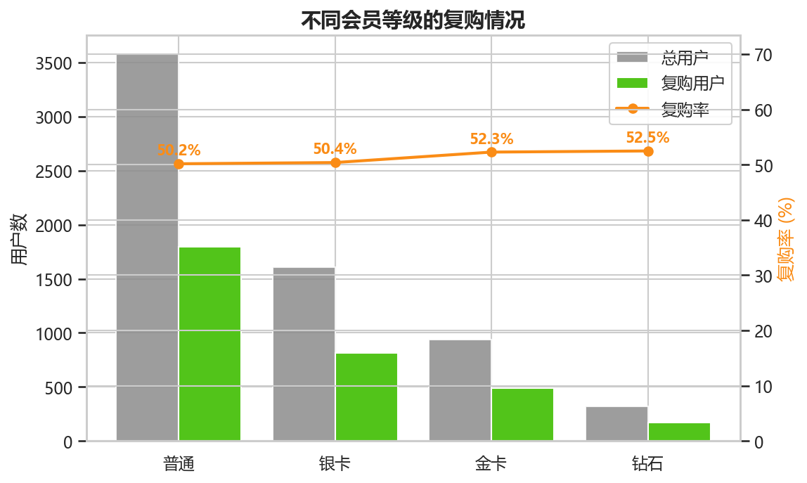

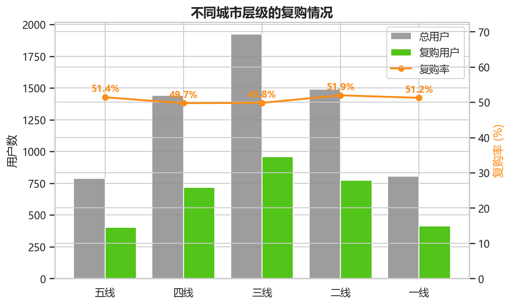

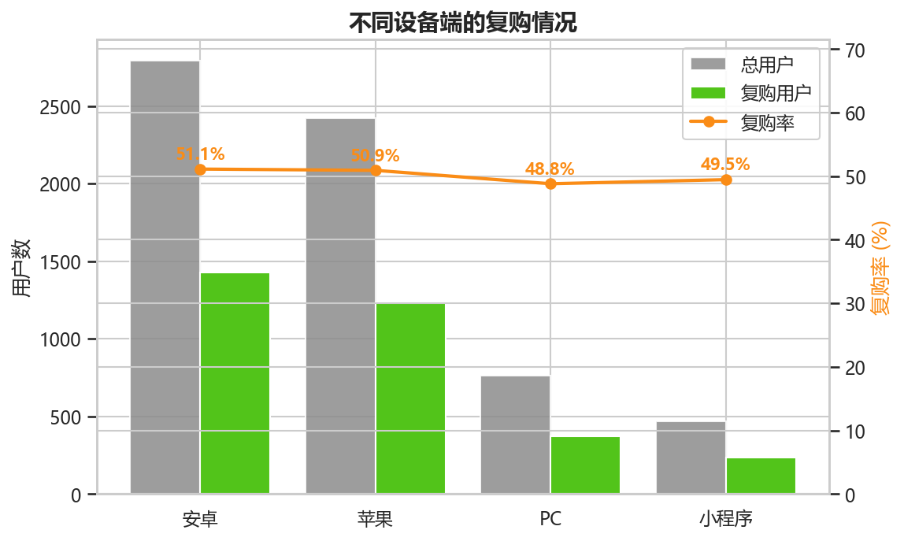

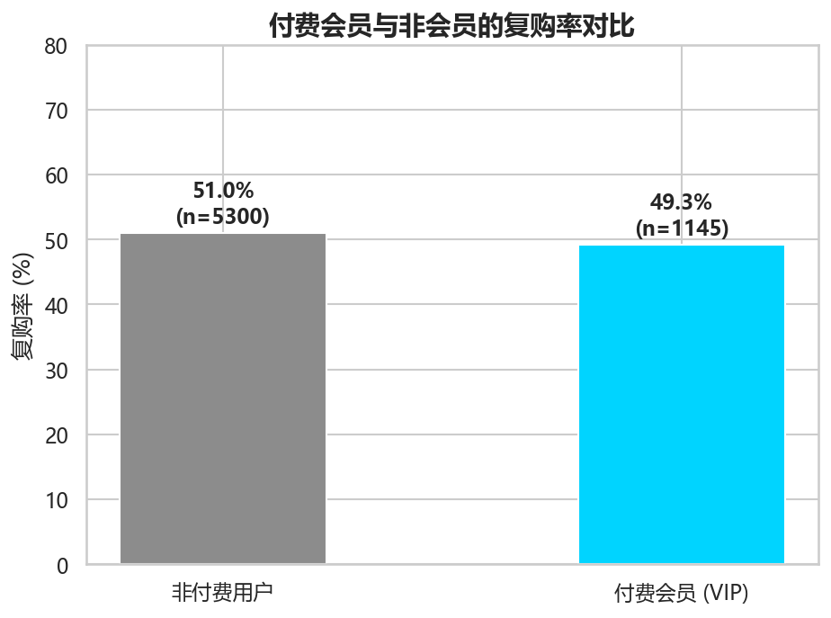

✍️ **你的分析**：观察不同层级复购率的梯度差异（如会员等级越高复购率越高？）、城市层级是否存在分层、设备端差异、以及 VIP 付费并未显著提升复购这一反直觉结论的运营启示。

---

## 3. 消费与行为特征分析

**关键发现**：

| 指标 | 流失用户 | 复购用户 | 差异 |
|:---|:---:|:---:|:---:|
| 平均消费 | ¥395.3 | ¥625.3 | 复购用户高 **58.2%** |
| 中位消费（全体） | — | ¥151.6 | 均值远高于中位数 → 长尾分布 |
| 优惠券使用率 | — | 97.8% | 促销渗透率高 |
| 静默用户（≥30 天未下单） | — | 5876 人（91.2%） | 静默是普遍现象 |
| 静默天数中位数 | — | 182 天 | 一半用户半年未下单 |

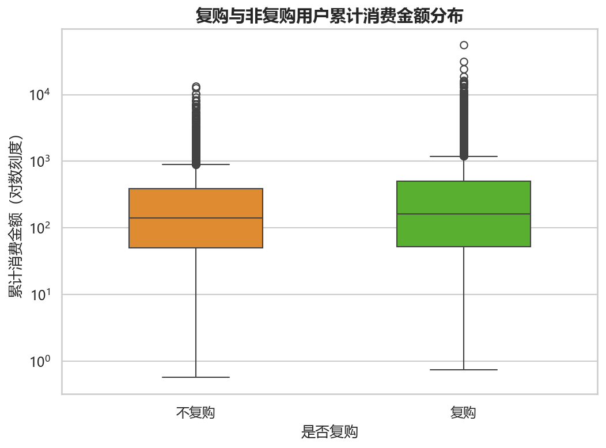

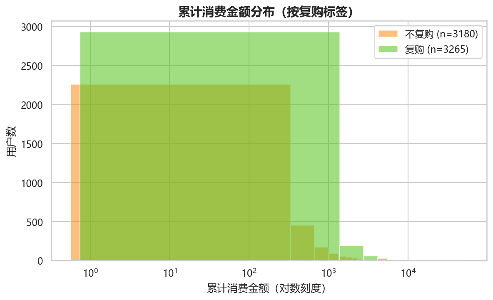

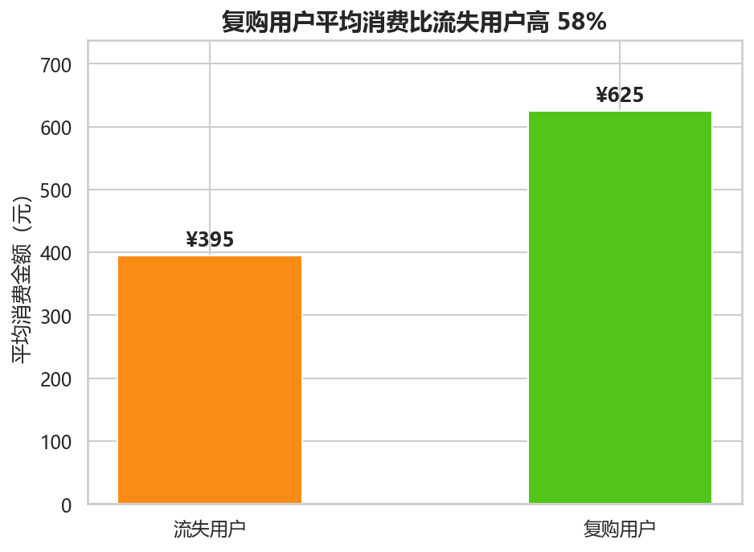

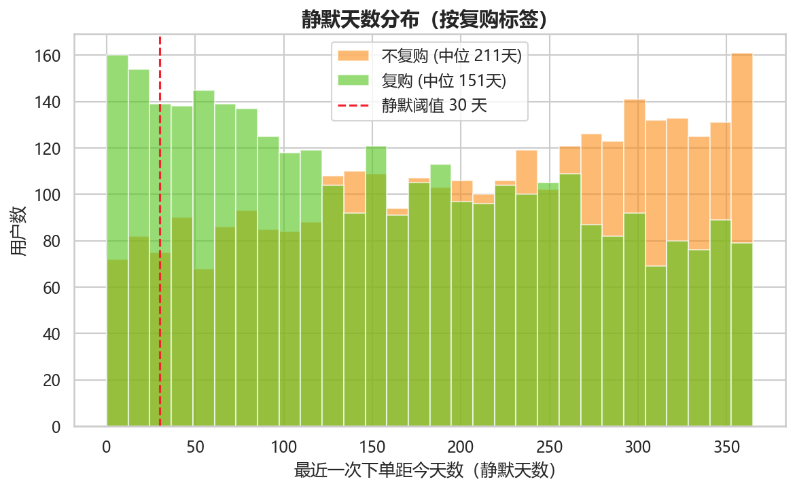

✍️ **你的分析**：结合箱线图/直方图说明消费分布的长尾特征与对数变换必要性；复购用户均消高 58% 说明"复购识别 = 高价值用户识别"；静默天数分布揭示召回运营的目标人群。

---

## 4. 特征相关性分析

对 36 维特征计算 Pearson 相关系数矩阵，识别多重共线性结构（如 `total_order_num` 与 `month_order_avg`、`total_consume` 与 `avg_order_price` 等强相关）。

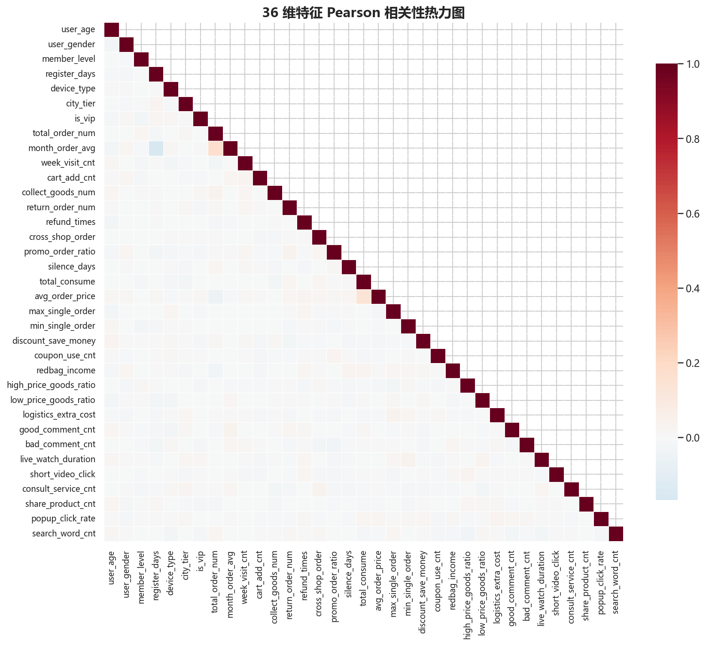

✍️ **你的分析**：指出明显的高相关特征簇（消费类、频次类、交互类），说明共线性对线性模型/系数解释的影响，以及这正是引入 PCA + 因子分析融合降维的动机。

---

## 5. 降维分析：PCA + 因子分析

**PCA 主成分分析**：自动选择满足累计方差 ≥ 95% 的主成分数，实测选取 **31 个主成分，累计解释方差 96.5%**——即用 31 维保留了原 36 维 96.5% 的信息。

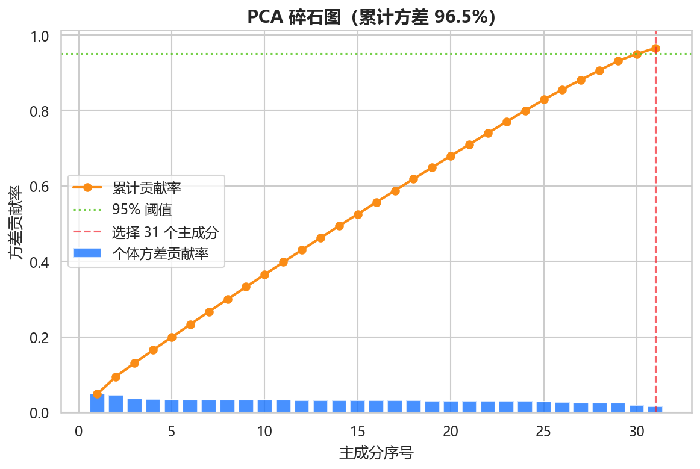

**探索性因子分析**：提取 **10 个公因子**，因子载荷气泡图展示前两个因子（横轴为因子 1，纵轴为因子 2）。每个气泡代表一个特征：**颜色区分特征分组**（用户画像 / 消费频次 / 消费金额 / 交互行为），**气泡大小表示公因子方差（共同度）**——越大说明该特征被公因子解释得越充分。可尝试将两轴解释为"金额 / 消费强度维度"与"活跃 / 交互维度"。

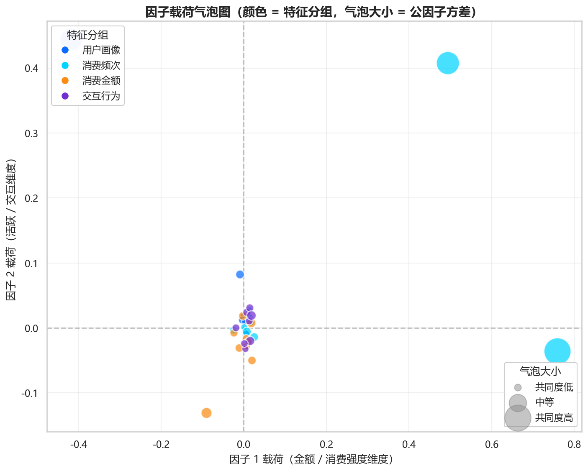

✍️ **你的分析**：结合碎石图说明"肘部"拐点与阈值选择逻辑；结合因子载荷图命名各公因子（金额因子、活跃因子、售后因子等），说明融合降维"方差保留 + 业务可解释"的互补优势。

---

## 6. 模型构建与评估

**实验设置**：训练集 70% / 测试集 30%，分层采样，随机种子固定（42）保证可复现；SVM 采用 RBF 核，随机森林 100 棵树、最大深度 10。

**双模型对比结果**：

| 指标 | SVM | 随机森林 |
|:---|:---:|:---:|
| 准确率 | 0.615 | 0.626 |
| 精确率 | 0.630 | 0.637 |
| 召回率 | 0.610 | 0.636 |
| F1 | 0.620 | 0.636 |
| AUC | 0.668 | **0.671** |

✍️ **你的分析**：对比两模型优劣（随机森林在精确率/召回率/AUC 全面略优，符合树模型对高维非线性特征鲁棒、无需标准化的特点）；说明为何以 AUC 为核心指标；结合 ROC 曲线说明模型排序能力。

---

## 7. 特征重要性分析

随机森林输出特征重要性，Top10 如下：

| 排名 | 特征 | 重要性 |
|:---:|:---|:---:|
| 1 | 累计加购件数 `cart_add_cnt` | 0.108 |
| 2 | 静默天数 `silence_days` | 0.102 |
| 3 | 总下单次数 `total_order_num` | 0.080 |
| 4 | 月均下单量 `month_order_avg` | 0.053 |
| 5 | 累计消费 `total_consume` | 0.049 |
| 6 | 注册天数 `register_days` | 0.036 |
| 7 | 优惠减免金额 `discount_save_money` | 0.034 |
| 8 | 活动订单占比 `promo_order_ratio` | 0.033 |
| 9 | 低价商品占比 `low_price_goods_ratio` | 0.033 |
| 10 | 直播观看时长 `live_watch_duration` | 0.033 |

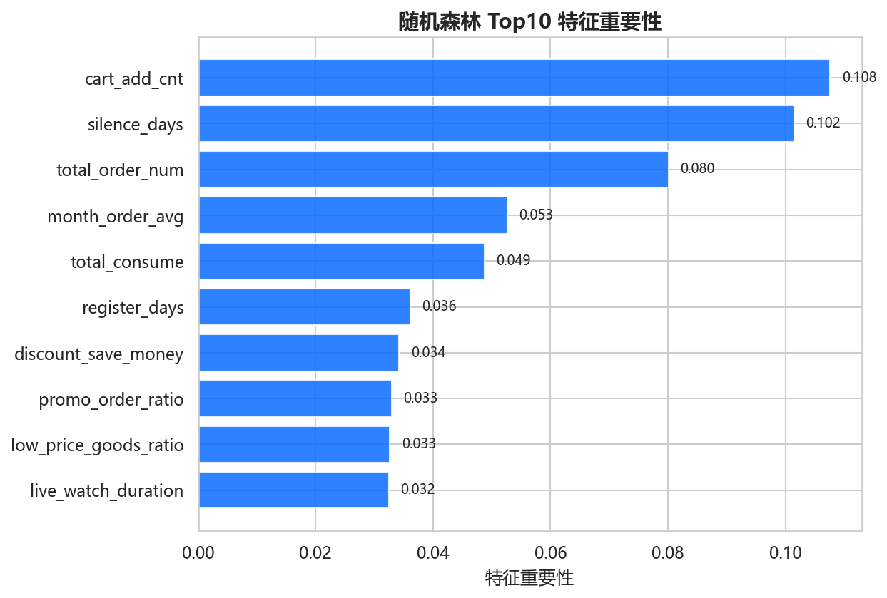

✍️ **你的分析**：解读特征重要性与业务直觉的一致性（行为强度决定复购概率）；静默天数排名第 2 与数据现状相互印证；据此给出运营建议（加购关怀、静默召回、高价值用户分层）。

---

## 8. 总结与业务建议

**总结要点**

1. 样本正负均衡，复购率 51.4%；复购用户均消高 58%，"识别复购"即"识别高价值"；
2. 36 维特征存在明显多重共线性，通过 PCA + 因子分析融合降维，兼顾信息保留（96.5%）与业务可解释性；
3. 随机森林在复购预测上略优于 SVM（AUC 0.671 vs 0.668），工程上更易落地；
4. 特征重要性揭示：加购、下单、消费、静默四大行为是复购的核心驱动。

**业务建议**（示例）：

- 对"高加购但低转化"用户做加购关怀与促销转化；
- 对静默用户（≥30 天）启动召回策略，优先高历史消费人群；
- 依据模型概率分层运营：高概率人群维护忠诚、中概率人群促转化、低概率人群降低触达成本。

---

*报告图表由 `tools/generate_analysis.py` 基于真实数据自动生成，重新运行脚本可一键刷新全部图表与统计。*
